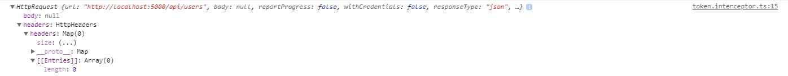
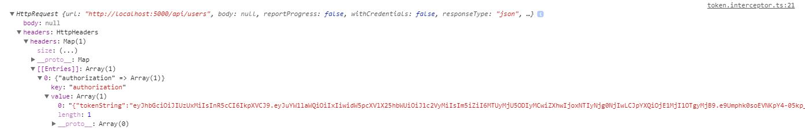

## Creating the Http Interceptor ##
The first task is to create an `Interceptor` class which implements the `HttpInterceptor` interface.
The function of this class is to include a locally stored Json Web Token as the Authorization header in
all Http requests sent to the server.

The `Interceptor` class will use the `getToken()` method supplied by my `Authorization` service to retrieve the JWT:

```typescript
//src/app/auth/auth.service.ts
@Injectable()
export class AuthService {
    constructor(private _http: HttpClient) { }
  
    public login() {
        ...
    }
    
    public logout() {
        ...
    }
    
    public getToken(): string {
      return localStorage.getItem('currentUser');
    }
}
```

Below is the implementation of the  `TokenInterceptor`, which implements the property 
`intercept` from `HttpInterceptor`. 

Before we send the request to the server, we need to clone the `HttpRequest` object
as it is immutable. Once cloned we can add in the Authorization header information:

```typescript
//src/app/auth/token.interceptor.ts
import {HttpEvent,
  HttpHandler,
  HttpInterceptor,
  HttpRequest
} from '@angular/common/http';
import {AuthService} from './auth.service';
import {Observable} from 'rxjs/Observable';
import {Injectable} from '@angular/core';

@Injectable()
export class TokenInterceptor implements HttpInterceptor {
  constructor(private auth: AuthService) { }

  intercept(httpRequest: HttpRequest<any>, httpHandler: HttpHandler): Observable<HttpEvent<any>> {
    httpRequest = httpRequest.clone({
      setHeaders: {
        Authorization: this.auth.getToken()
      }
    });
    return httpHandler.handle(httpRequest);
  }
}
```

In the code above, we simply add an Authorization header to the request. We are then
returning control to the next interceptor in the chain. In my case, I have another interceptor
to handle user permissions.

## Using the Interceptor ##
To use the `TokenInterceptor`, we first need to add it to `HTTP_INTERCEPTORS`, 
which represents an array of interceptors that are registered.
We do this by adding our interceptor to the providers array in `app.module.ts`:

```typescript
//src/app/app.module.ts
import {HTTP_INTERCEPTORS, HttpClientModule} from '@angular/common/http';
import { TokenInterceptor } from './auth/token.interceptor';

@NgModule({
  declarations: [
    ...
  imports: [
    ...
  ],
  providers: [
    {
      provide: HTTP_INTERCEPTORS,
      useClass: TokenInterceptor,
      multi: true
    },
    ...
})
```

If we now make a Http request to the server, the JWT should be automatically
attached to the request header.

The following images show the `HttpRequest` before and after the intercept:





## Conclusion ##
The `HttpInterceptor` interface ultimately simplifies a previously long-winded operation of 
controlling Http requests and helps reduce the amount of code required to fulfill the same task.

The next stage for me will be to check for unauthorized responses using Angular's Router Guard feature 
in conjuction with the `HttpInterceptor` to appropriately navigate the user to the login page
once their session has expired.